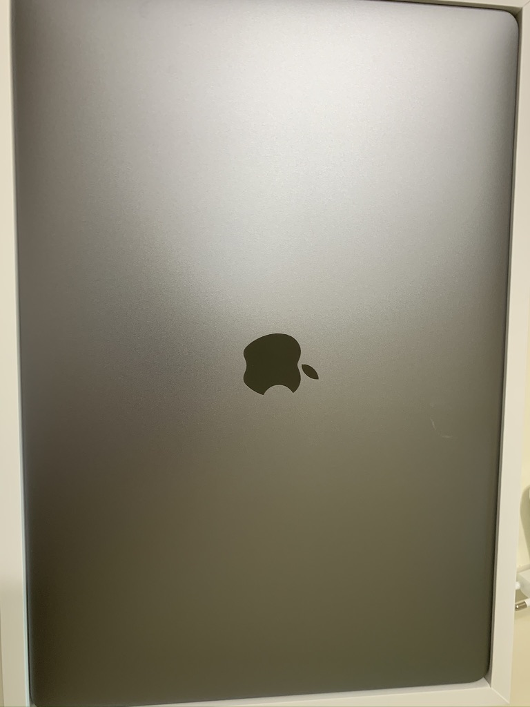

맥북 프로를 구입했습니다. 예전부터 구입하고 싶던 물건인데, 이렇게 제 손에 들어와보니 정말 좋습니다.

# 과거에 쓰던 노트북

저는 1년 전부터 ASUS ZenBook 14 UX433을 썼었습니다. 그러나 막상 개발용으로 구입하고 보니 약간 불만족스러운 점들이 있었습니다.

* 14인치지만, 저는 만족하지 못하고 더 큰 화면을 원했습니다.
* 가끔씩 타이핑 하는 데 렉이 걸리거나, 자동 완성이 느리게 처리되곤 했습니다.
* 제가 물건을 아끼는 성격이 아니다 보니, 꽤 여기저기 깨졌습니다...

위와 같은 불만족 사항들과 더불어, 저는 iPhone 유저이다보니 Mac과의 연동성을 바랐고, 전에 쓰던 노트북이 좋지 않은 물건은 아니었지만, 맥북 프로를 원하게 되었던 찰나에 마침 바꿀 수 있는 기회가 생겨 맥북 프로 16인치 기본형 모델을 주문하게 되었습니다.

# 하루 써보고 느낀 점
역시 애플 물건답게, 완성도가 높고 마감이 좋습니다. 세세한 부분에서 신기함을 느꼈습니다. (전원을 끄고 충전기를 연결하니 소리가 난다던가, 덮개를 여니 자동으로 켜진다던가) 하루 사용해 본 바로는 비싼 것 빼고는 딱히 흠잡을 곳이 없어보입니다.
